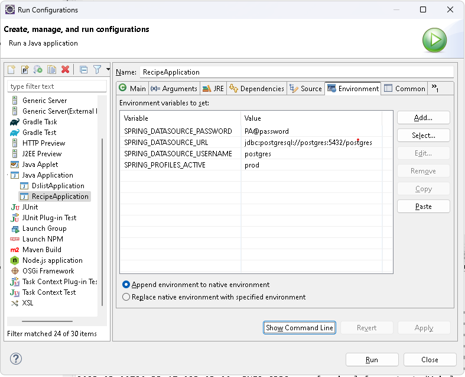

## 🚀 Como iniciar o projeto - Docker
docker-compose up --build -d

## 🚀 swagger (desativado no pom.xml)
http://localhost:8080/swagger-ui/index.html

## 📁 Estrutura de Pacotes Recomendada

com.nexuscare.recipe

| Pacote         | Descrição                                                  |
|----------------|------------------------------------------------------------|
| `controller`   | Camada de entrada (REST APIs)                              |
| `dto`          | Objetos de transferência de dados (Data Transfer Object)   |
| `model`        | Entidades JPA (ou `entity`)                                |
| `repository`   | Repositórios Spring Data JPA (substitui a camada DAO)      |
| `service`      | Camada de regras de negócio (serviços)                     |
| `mapper`       | Conversores entre `model` e `dto` (usando MapStruct, etc.) |
| `config`       | Configurações da aplicação (Swagger, CORS, Security, etc.) |

## 📁 Configurar variável de ambiente do eclipse

